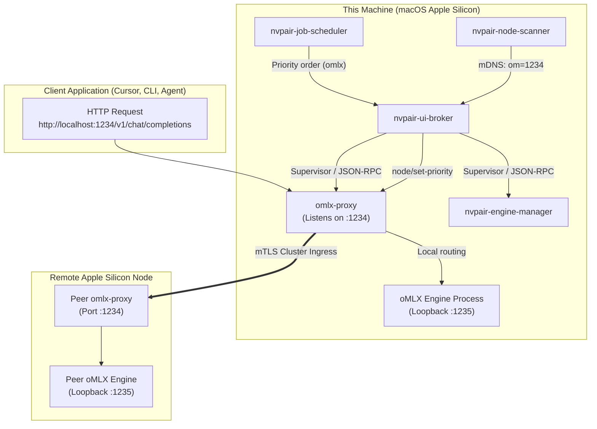

{/*
SPDX-FileCopyrightText: Copyright (c) 2026 NVIDIA CORPORATION & AFFILIATES. All rights reserved.
SPDX-License-Identifier: Apache-2.0
*/}

# Specification & Implementation Plan: oMLX Engine Integration in PAIR

## 1. Executive Summary

**oMLX** is an open-source, high-performance LLM inference server designed specifically for Apple Silicon Macs, built upon Apple's **MLX** framework and `mlx-lm`. Its standout architectural feature is **paged SSD KV-caching**, which enables near-instant context restoration for multi-turn conversations and long-context coding workflows.

This specification details the end-to-end architecture and implementation plan for adding **first-class oMLX engine support** to NVIDIA Personal AI Router (PAIR), enabling peer-to-peer routing and clustering across MacBooks running oMLX alongside existing Ollama and LM Studio nodes.

### Confirmed Design Decisions
1. **Default Port (1234):** Use port `1234` as the default OpenAI compatibility port for `omlx-proxy`, mirroring standard local developer tool expectations. The underlying oMLX backend process binds to `1235` on loopback.
2. **Platform Scoping:** Restrict local engine execution exclusively to Apple Silicon Macs (`darwin/arm64`). Mixed-architecture clusters are fully supported: non-Apple nodes (Linux, Windows, Intel Mac) cannot run oMLX locally, but can seamlessly discover and route requests to an Apple Silicon Mac running oMLX.
3. **Dedicated Proxy Binary:** Follow PAIR convention by creating a dedicated `services/omlx-proxy` binary supervised by `nvpair-ui-broker`.
4. **Engine Coexistence & Port Arbitration:** If both LM Studio and oMLX are installed on the same machine, PAIR's existing broker port arbitration logic steers the second engine to a clean alternative port (`1236` or `8000`) without hard crash or silent failure.

---

## 2. Architecture & Service Topology



---

## 3. Detailed Component Specifications

### 3.1 Layer 1: Engine Manifest (`services/nvpair-engine-manager`)

Create `manifests/omlx.json` in `services/nvpair-engine-manager`:

```json
{
  "engine": "omlx",
  "display_name": "oMLX",
  "manifest_version": 1,
  "detect": [
    "~/.omlx/bin/omlx",
    "/opt/homebrew/bin/omlx",
    "/Applications/oMLX.app/Contents/MacOS/omlx"
  ],
  "install": {
    "fetch": { "url": "https://omlx.ai/install.sh" },
    "run": ["bash", "{download}"],
    "mode": "user"
  },
  "uninstall": {
    "run": ["sh", "-c", "pkill -x omlx 2>/dev/null; sleep 2; rm -rf \"$HOME/.omlx\""]
  },
  "runtime": {
    "mode": "command",
    "port": 1235,
    "bind": "127.0.0.1",
    "start": [["{cli}", "serve", "--port", "{port}", "--host", "{host}"]],
    "stop": { "cmd": ["{cli}", "stop"] },
    "ready": { "http": "http://127.0.0.1:{port}/v1/models", "status": 200, "timeout_s": 45 },
    "health": { "http": "http://127.0.0.1:{port}/v1/models", "status": 200, "interval_s": 10 }
  },
  "platforms": {
    "darwin/arm64": {
      "runtime": { "cli": "~/.omlx/bin/omlx" }
    }
  },
  "actions": {
    "list_models": {
      "description": "List models downloaded and available in oMLX.",
      "http": { "method": "GET", "path": "/v1/models" },
      "result": { "array": "data", "field": "id" }
    },
    "loaded_models": {
      "description": "List models currently active in memory.",
      "http": { "method": "GET", "path": "/v1/models" },
      "result": { "array": "data", "field": "id" }
    },
    "pull_model": {
      "description": "Download an MLX model from Hugging Face.",
      "cmd": ["{cli}", "pull", "{model}"]
    },
    "chat": {
      "description": "OpenAI-compatible chat completions.",
      "http": { "method": "POST", "path": "/v1/chat/completions", "body_schema": { "model": "string", "messages": "array" } }
    },
    "delete_model": {
      "description": "Delete a downloaded model from local storage.",
      "cmd": ["{cli}", "rm", "{model}"]
    }
  }
}
```

*Note: On non-`darwin/arm64` platforms (Windows, Linux, Intel Mac), the absence of matching platform runtime entries causes `nvpair-engine-manager` to report the engine as unsupported.*

---

### 3.2 Layer 2: Dedicated Routing Proxy (`services/omlx-proxy`)

Create `services/omlx-proxy/` as a modular build target in `services/`:

1. **CLI Flags & Defaults:**
   - `--port`: Default `1234` (falls back to `proxy-port.json` if persisted or broker assigned).
   - `--ipc`: StdIO or IPC socket for broker communication.
   - `--cluster-dir`: mTLS trust directory with pinned certificates.
2. **Dual Personalities on Port 1234:**
   - **Plaintext HTTP (Loopback only):** Accepts requests from local tools (`127.0.0.1`), enforces CORS, and executes cluster routing.
   - **Mutual TLS (Cluster Ingress):** Peer connections presenting pinned certificates are authenticated and forwarded directly to the local oMLX backend (`127.0.0.1:1235`) without re-routing.
3. **Discovery Relay Subscription:**
   - On startup, registers with broker discovery:
     `{"method": "discovery:subscribe", "params": {"services": ["om"]}}`
4. **Cluster Fanout Routes:**
   - `GET /v1/models` is fanned out across all discovered oMLX nodes concurrently, and deduplicated before returning.
5. **Workload Emissions:**
   - Emits `workload:started`, `workload:completed`, and `workload:errored` with `"engine": "omlx"`.

---

### 3.3 Layer 3: Discovery, Telemetry & Manual Nodes

1. **Service Tag Registration (`services/nvpair-node-scanner`):**
   - Reserve service tag **`om`** for oMLX.
   - In `_nvpair-node._tcp` mDNS TXT record:
     ```text
     txt=["uuid=...", "om=1234", "ol=11434", ...]
     ```
2. **Discovery Relay:**
   - The scanner filters `om` nodes and publishes them to subscribers.
3. **Manual Node Probing (`services/nvpair-manual-nodes`):**
   - Add probe leg for oMLX on port `1234` (`GET /v1/models`).
   - Emit status properties: `omlx_up`, `omlx_port`, `omlx_models`.
4. **Node Info API (`services/nvpair-node-info`):**
   - Report `modelsByEngine["omlx"]` and `loadedByEngine["omlx"]` in `/v1/node-info`.

---

### 3.4 Layer 4: Supervision, Broker & Scheduler

1. **Job Scheduler (`services/nvpair-job-scheduler`):**
   - Update `schedule.go` in `nvpair-job-scheduler`:
     ```go
     var schedulerEngines = []string{"ollama", "lmstudio", "omlx"}
     ```
   - Emits `schedule:priority` with `"engine": "omlx"` containing ranked node orders.
2. **UI Broker (`services/nvpair-ui-broker`):**
   - Add flag `--omlx-proxy-path`.
   - Add `omlxProxySup` worker supervisor handle in `broker.go`.
   - Relay JSON-RPC methods:
     - `omlx-proxy:get-status`
     - `omlx-proxy:set-port`
     - `omlx-proxy:subscribe` / `omlx-proxy:unsubscribe`
     - Pass-through `omlx-proxy:*` to `omlx-proxy`.
   - **Port Collision Management**: When starting, if both `lmstudio-proxy` and `omlx-proxy` attempt to bind `1234`, the broker detects the collision, assigns the primary to the active running engine, and assigns the secondary to the next free fallback port (e.g. `1236` or `8000`), raising a sticky advisory warning in the errors pipeline.
3. **Build & Version Manifests:**
   - Register `omlx-proxy` in `services/versions.json`:
     ```json
     "omlx-proxy": "0.1.0"
     ```
   - Update `services/build.sh` and `services/build.bat` to compile `omlx-proxy`.

---

### 3.5 Layer 5: Desktop Application & TypeScript Contracts

1. **Engine Constants & Types (`desktop/src/shared/constants/engines.ts`):**
   ```typescript
   export const EngineTypes = ['ollama', 'lm-studio', 'omlx'] as const
   export const EnabledEngineTypes: EngineType[] = ['ollama', 'lm-studio', 'omlx'] as const

   export const EngineDisplayNames: Record<EngineType, string> = {
       ollama: 'Ollama',
       'lm-studio': 'LM Studio',
       omlx: 'oMLX'
   } as const

   export const EngineDefaultLinks: Record<EngineType, { docsUrl: string; installUrl: string }> = {
       ollama: { docsUrl: 'https://docs.ollama.com/', installUrl: 'https://ollama.com/download' },
       'lm-studio': { docsUrl: 'https://lmstudio.ai/docs', installUrl: 'https://lmstudio.ai/' },
       omlx: { docsUrl: 'https://omlx.ai/', installUrl: 'https://omlx.ai/' }
   } as const
   ```

2. **Binary Inventory (`desktop/src/shared/constants/modular-binaries.ts`):**
   - Add `omlx-proxy` to the runtime inventory for target `darwin-arm64`.

3. **Supervisor & Bridge (`desktop/src/electron/service-bridge/`):**
   - Update `modular-state.ts`:
     ```typescript
     export type ProxyEngine = Extract<EngineType, 'ollama' | 'lm-studio' | 'omlx'>
     ```
   - Wire oMLX lifecycle commands (install, start, stop, pull model, delete model) into `modular-supervisor.ts`.

4. **Service Contract Updates:**
   - Run `npm run service-contracts:write` to regenerate API documentation and bridge types.
   - Verify with `npm run service-contracts:check`.

---

## 4. Phased Implementation Steps

### Phase 1: Engine Manifest & Process Management
- Write `services/nvpair-engine-manager/manifests/omlx.json`.
- Add test coverage in `services/nvpair-engine-manager/registry_test.go`.
- Validate detection, start, stop, and model listing against mock oMLX responses.

### Phase 2: Proxy Development (`services/omlx-proxy`)
- Scaffold `services/omlx-proxy` based on `lmstudio-proxy` architecture.
- Configure port `1234` as default compatibility listener.
- Implement loopback plaintext and mTLS ingress split listener.
- Implement `/v1/models` fanout and deduplication.
- Run `go test ./...` in `services/omlx-proxy`.

### Phase 3: Broker, Scanner & Scheduler Integration
- Update `services/nvpair-node-scanner` to publish and parse the `om` service tag.
- Update `services/nvpair-job-scheduler` to rank `omlx` engines.
- Wire `--omlx-proxy-path` and supervisor logic in `services/nvpair-ui-broker`.
- Update `services/versions.json` and `services/build.sh`.

### Phase 4: Desktop UI & Contract Tooling
- Update `desktop/src/shared/types/engines.ts` and `desktop/src/shared/constants/engines.ts`.
- Update preload bridge and state handlers in `desktop/src/electron/service-bridge/`.
- Add oMLX icon to Kaizen UI asset set.
- Run `npm run service-contracts:write`.
- Run `make check` (`npm run lint`, `npm run typecheck`, `npm run service-contracts:check`, `npm run test:unit`, `node scripts/spdx-headers.mjs`).

### Phase 5: End-to-End Verification
- **Test Case 1 (Local adoption):** Start oMLX on port 1235 on an Apple Silicon Mac; start PAIR; verify oMLX is adopted, models are inventoried, and queries to `http://localhost:1234/v1/chat/completions` succeed.
- **Test Case 2 (Cluster routing):** Form a 2-node cluster with one Mac running oMLX and another running Ollama. Send an oMLX-hosted model query to the Ollama node's endpoint; verify cross-node routing over mTLS.
- **Test Case 3 (SSD KV-Cache validation):** Run a 3-turn long-context conversation over PAIR to the oMLX node; observe sub-second TTFB on turns 2 and 3.

---

## 5. Architectural Verification & Security Checklist

- [ ] **SPDX Headers:** All newly added files (`.go`, `.ts`, `.json`) carry standard 2-line Apache-2.0 SPDX headers.
- [ ] **No Type Casting:** TypeScript code contains no `as any`, `as Type`, or `: any`.
- [ ] **Privacy Guarantee:** No prompt bodies, messages, or completion streams are logged to stdout, stderr, or stored in workload events.
- [ ] **Versions:** Bumping of `versions.json` entries for modified service binaries.
- [ ] **DCO Sign-off:** All commits signed off with `git commit -s`.
