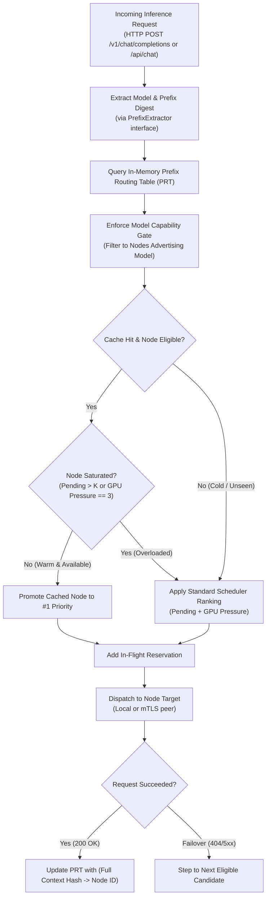

{/*
SPDX-FileCopyrightText: Copyright (c) 2026 NVIDIA CORPORATION & AFFILIATES. All rights reserved.
SPDX-License-Identifier: Apache-2.0
*/}

# Specification: Engine-Agnostic Prefix-Cache & Conversation-Aware Routing

## 1. Overview & Objectives

In large language model (LLM) inference, multi-turn conversations and long-prompt workflows (such as coding assistants, agentic loops, and RAG pipelines) repeatedly reuse significant portions of the prompt context across successive requests. Modern inference engines (Ollama, LM Studio, vLLM, TensorRT-LLM, `llama.cpp`) maintain an in-memory **Key-Value (KV) cache** for prompt prefixes. When a request hits a node holding the warm KV cache for that prefix, **prompt prefill is bypassed**, reducing Time-To-First-Byte (TTFB) from seconds to milliseconds.

### Current Limitation in PAIR
PAIR routes every HTTP request as an independent, stateless event. Under concurrent load or multi-node clustering with duplicate models, consecutive conversational turns can easily be steered to different nodes due to GPU pressure metrics or in-flight reservations. This results in severe **cache thrashing** and forces secondary nodes to recompute the entire context history from token zero.

### Design Goals
1. **Engine Agnostic:** Support OpenAI chat/completions format, Ollama format, and easily extend to Anthropic or future engine interfaces (vLLM, TensorRT-LLM) without core proxy rewrites.
2. **Zero Plaintext Leakage (Strict Privacy):** Never log, store, or transmit prompt text, messages, or completion bodies. Use deterministic, one-way cryptographic digests (SHA-256) only.
3. **Passive / Router-Side Implementation:** Zero dependency on engine-level KV cache query APIs. The router tracks prefix disposition locally.
4. **Adaptive Load Balancing vs. Cache Affinity:** Prioritize warm cache nodes while intelligently bypassing affinity if the cached node is offline or heavily saturated.
5. **Deterministic Failover:** Retain PAIR's existing ordered failover list semantics.

---

## 2. Architecture & Request Flow



---

## 3. Core Component Design

### 3.1 Prefix Extractor Interface (`nvpair-shared/prefixhash`)

To ensure the system is completely decoupled from any single engine format, extraction logic is placed in a shared package: `services/shared/prefixhash`.

```go
package prefixhash

import (
    "io"
    "net/http"
)

// Digest is a 32-byte SHA-256 hash representing a normalized prompt prefix.
type Digest [32]byte

// PrefixExtractor parses a request body and returns the model name and the
// prefix digest. The prefix digest represents all conversational turns up
// to, but excluding, the newest user generation turn.
type PrefixExtractor interface {
    // Matches reports whether this extractor handles the given HTTP request.
    Matches(r *http.Request) bool
    // Extract extracts the model name and the deterministic prefix digest.
    // Returns an empty digest if the request cannot be parsed or represents
    // a standalone, non-contextual prompt.
    Extract(body []byte) (model string, prefix Digest, fullContext Digest, err error)
}
```

#### Supported Format Implementations:

1. **OpenAI Format (`OpenAIExtractor`)**:
   - Targets: `/v1/chat/completions`
   - Algorithm:
     - Parse JSON structure: `{"model": string, "messages": [{"role": string, "content": string}, ...]}`.
     - For $N$ messages, if $N \ge 2$, canonicalize `messages[0...N-2]` as the prefix.
     - Canonicalize `messages[0...N-1]` as the `fullContext`.
     - Hash representation: `SHA256(canonical_json(messages[0...N-2]))`.

2. **Ollama Format (`OllamaExtractor`)**:
   - Targets: `/api/chat` and `/api/generate`
   - Algorithm:
     - For `/api/chat`: Canonicalizes message history identically to OpenAI format.
     - For `/api/generate` with `context` parameter: Hashes the integer token array `context: [int...]` supplied by multi-turn Ollama clients.

3. **Fallback / Extensible Extractor**:
   - For pure completion endpoints (`/v1/completions` or `/api/generate` raw prompts):
     - Hashes the initial $M$ bytes (e.g. first 1,024 bytes) of the prompt string to identify shared system instructions or document context headers.

---

## 3.2 In-Memory Prefix Routing Table (PRT)

The PRT tracks which node served which context and when. It is maintained in memory inside the proxy process.

```go
package prefixhash

import (
    "sync"
    "time"
)

type RouteRecord struct {
    NodeID     string
    Engine     string
    LastUsedAt time.Time
}

type PrefixRoutingTable struct {
    mu      sync.RWMutex
    entries map[string]RouteRecord // Key: model + ":" + hex(prefixDigest)
    maxCap  int
    ttl     time.Duration
}

func NewPrefixRoutingTable(maxCap int, ttl time.Duration) *PrefixRoutingTable {
    return &PrefixRoutingTable{
        entries: make(map[string]RouteRecord),
        maxCap:  maxCap,
        ttl:     ttl,
    }
}
```

#### Eviction & Pruning:
- **Time-to-Live (TTL):** Defaults to **5 minutes** (300 seconds), aligning with Ollama and LM Studio default in-memory model keepalives (`keep_alive = 5m`). Entries older than 5 minutes without use are pruned.
- **Capacity Bound:** Default capacity is **10,000 entries**. An LRU eviction strategy discards the oldest accessed entry when capacity is reached.

---

## 3.3 Cache-Aware Candidate Selection Algorithm

The core routing logic lives in the proxy request pipeline (`resolveCandidates()` and `reserveCandidate()`):

1. **Model Capability Gate (Hard Filter):**
   Filter all cluster nodes to only those advertising the requested model.
2. **Manual Pin Check:**
   If a manual node pin is active and eligible, it takes top precedence.
3. **Cache Affinity Evaluation:**
   If `prefixDigest` is non-zero, query PRT for `(model, prefixDigest)`.
   If a record exists for `NodeX`:
   - Verify `NodeX` is in the eligible candidate set.
   - Query `NodeX`'s current load metrics from scheduler state:
     - `pendingJobs`: current active requests on `NodeX`.
     - `gpuPressure`: coarse GPU pressure (0 to 3).
   - **Affinity Decision Rule:**
     $$ \text{Maintain Affinity} \iff \text{pendingJobs} \le K_{\text{max}} \quad \text{AND} \quad \text{gpuPressure} < 3 $$
     *(Recommended baseline: $K_{\text{max}} = 1$ concurrent job).*
4. **Promotion or Fallback:**
   - If affinity holds, move `NodeX` to the head of the candidate slice.
   - If `NodeX` is saturated or absent from the PRT, sort the candidates according to the scheduler's standard priority (`pending + gpuPressure`).
5. **Post-Dispatch Registration:**
   - When the response status is 200 OK and streaming completes successfully, write `(model, fullContextDigest) -> ServedNodeID` into the PRT. The next turn will match this hash.

---

## 4. Balancing Affinity vs. Node Saturation

A common pitfall of cache routing is overloading a warm node while idle nodes sit unused. The specification defines explicit threshold heuristics:

| Metric | Threshold Condition | Router Action |
| :--- | :--- | :--- |
| **Pending Jobs** | $\le 1$ job queued/running | **Preserve Cache Affinity:** Prioritize warm node. TTFB benefit exceeds minor queue delay. |
| **Pending Jobs** | $\ge 2$ jobs queued/running | **Bypass Affinity:** Spill over to next idle scheduler-ranked node. Prefill recompute is faster than waiting behind multiple generations. |
| **GPU Pressure** | Tier 3 ($\ge 85\%$ sustained load) | **Bypass Affinity:** Steer to idle machine to prevent VRAM allocation crashes or Metal throttling. |
| **Node Liveness** | Node misses $\ge 2$ discovery ticks | **Drop Affinity:** Immediately fallback to next node. |

---

## 5. Privacy & Security Invariants

In accordance with PAIR security rules:
- **No Text in Logs or Transits:** The PRT keys are strictly formatted as:
  `<model_name>:<hex_encoded_sha256_digest>` (e.g., `llama3.2:3b:9f83c12a...`).
- **One-Way Canonicalization:** Prompts cannot be reverse-engineered from SHA-256 digests.
- **Memory-Only PRT:** The PRT is purely transient in RAM. It is never written to disk during checkpointing or crash logging.
- **mTLS Cluster Sync (Optional Extension):** If PRT hints are gossiped across nodes via `nvpair-workload-manager`, only the tuple `(Digest, NodeUUID, Timestamp)` is transmitted over mTLS on port `14320`.

---

## 6. Implementation Plan & File Modifications

### Step 1: Shared Extractor & Table Package
- Create `services/shared/prefixhash/`:
  - `prefixhash.go`: Core types (`Digest`, `RouteRecord`, `PrefixExtractor`).
  - `table.go`: Thread-safe `PrefixRoutingTable` with LRU/TTL eviction.
  - `openai.go`: OpenAI chat JSON canonicalizer and extractor.
  - `ollama.go`: Ollama chat and generate format extractor.
  - `prefixhash_test.go`: Unit tests with varied JSON formatting, whitespace, and message depth.

### Step 2: Proxy Integration
- Update `services/ollama-proxy/proxy.go` and `services/lmstudio-proxy/proxy.go`:
  - Add `prt *prefixhash.PrefixRoutingTable` to `Proxy` struct.
  - In `bufferBodyAndModel()`: extract `prefixDigest` and `fullDigest` alongside the model.
  - In `resolveCandidates()`: check `prt.Lookup(model, prefixDigest)` and elevate the cached candidate if valid and under saturation threshold.
  - In `handleHTTP()`: upon successful stream termination, invoke `prt.Put(model, fullDigest, servedNodeID)`.

### Step 3: Telemetry & Observability
- Add a counter field to the JSON-RPC `proxy/request` completion notification:
  - `"cache_affinity": true | false`
- Display cache-affinity hit rate in the Desktop UI / TUI diagnostics.

---

## 7. Verification & Acceptance Criteria

1. **Multi-Turn Chat Benchmark:**
   - Execute a 5-turn conversation script (e.g. using `scripts/inference-dispatcher`).
   - *Verification:* In a 2-node cluster sharing the same model with zero background traffic, all 5 turns must route to the same node without manual pinning.
2. **Failover Verification:**
   - Simulate node crash/kill during turn 3.
   - *Verification:* The proxy must catch the transport error, fail over to Node B, process the turn, and update the PRT so turn 4 routes to Node B.
3. **Saturation Bypass Verification:**
   - Saturate Node A with a long continuous generation (`pending = 3`).
   - Send follow-up turn in an existing conversation previously on Node A.
   - *Verification:* The router must bypass Node A and dispatch to idle Node B.
4. **Zero Plaintext Verification:**
   - Inspect all stdout, stderr, JSON-RPC envelopes, and memory dumps. No prompt strings or message contents may appear.
